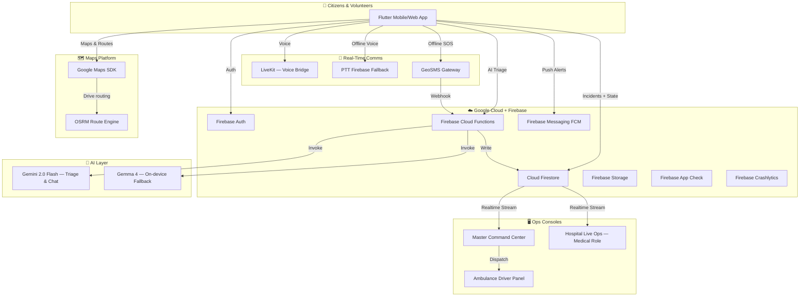
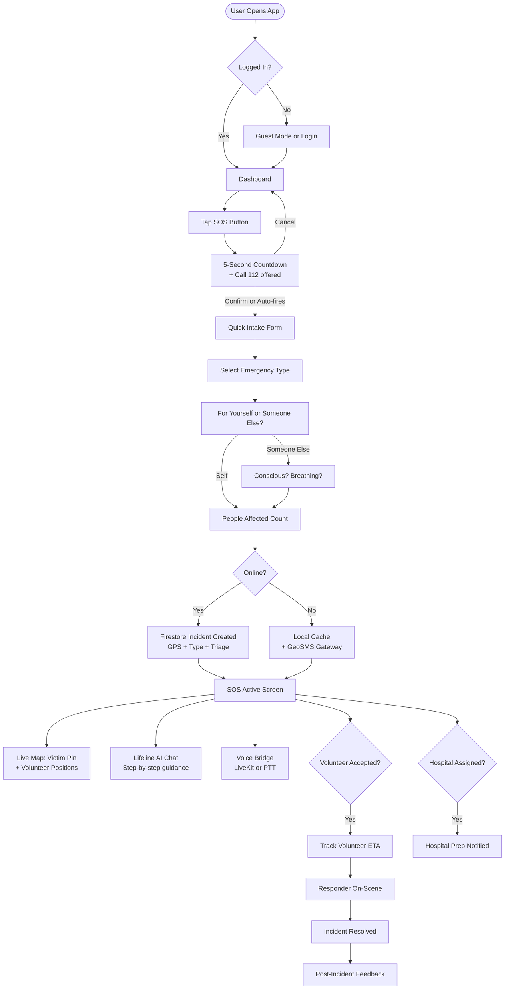
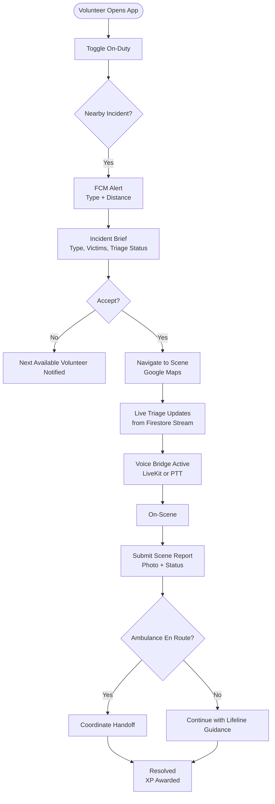
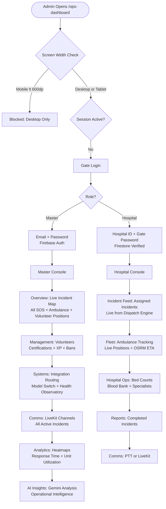
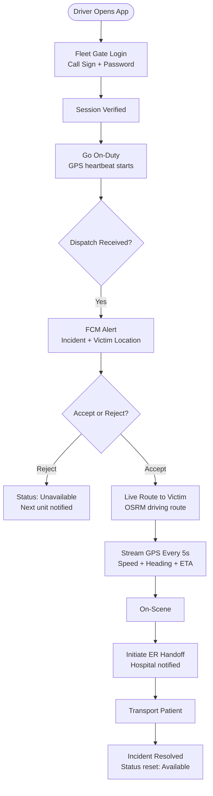
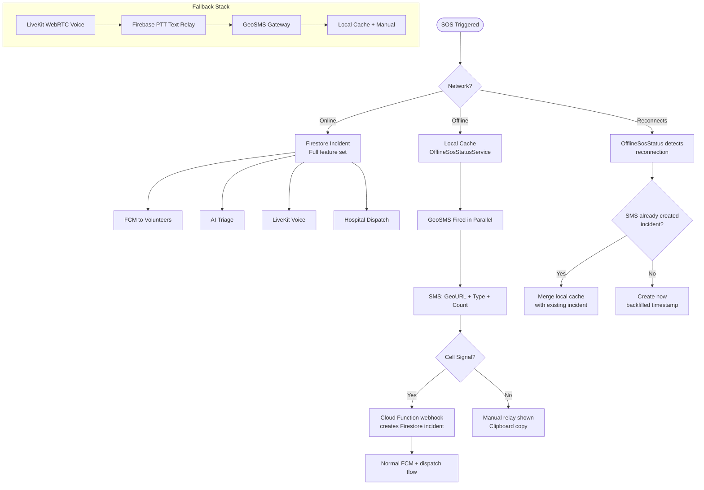

<div align="center">

<br/>


<br/>

### *Designed to Save Lives.*

<br/>

[](https://flutter.dev)
[](https://firebase.google.com)
[](https://ai.google.dev)
[](https://developers.google.com/maps)
[](https://livekit.io)
[](LICENSE)

<br/>

**By Shikhar Shahi (Afterburners) · Google Solution Challenge 2026**

<br/>

---

</div>

<br/>

## 💔 Why This Exists — A Personal Story

> *This is not a hackathon project. This is a response to a night I never want anyone else to live through.*

It was 2 AM. My mother collapsed.

I called the ambulance. It came — eventually. But there was no way to know where it was. No tracking, no ETA, no updates. We stood outside in the dark, not knowing if help was 2 minutes or 20 minutes away. Every second felt like a verdict.

When the ambulance finally arrived, we rushed to the nearest hospital. The doctor looked at her and said the words I wasn't prepared for:

**"We don't have a cardiologist available right now. You need to go to another hospital."**

We didn't know which hospital had a cardiologist. We didn't know which one had an open ICU bed. Nobody did. We just drove — fast, scared, and completely blind. We switched hospitals twice that night, each transfer burning precious minutes we didn't have.

My mother survived. By grace. Not by system.

That night I asked myself a question I couldn't stop thinking about: **What if there was a system that knew?** What if the ambulance was trackable? What if the hospital knew she was coming before she arrived? What if a CPR-certified volunteer nearby had reached her in those first 8 minutes while the ambulance was in traffic?

EmergencyOS is my answer.

---

<br/>

## 🚨 The Scale of the Problem in India

India has one of the world's largest populations and one of the most fragmented emergency response systems. The numbers are not statistics — they are people.

| Metric | Data |
|--------|------|
| 🏥 Average emergency response time in Indian cities | **8–15 minutes** |
| ❤️ Brain death begins during cardiac arrest | **4–6 minutes** |
| 🚑 Ambulance availability per 100,000 people | **~2 units** (WHO recommends 16) |
| 📱 Out-of-hospital cardiac arrest survival (India) | **< 5%** |
| 🏙️ Urban population without structured emergency access | **400+ million** |
| 📞 108 call-to-dispatch time (average) | **3–7 minutes** before movement |
| 🏨 Hospitals with real-time bed capacity systems | **< 8%** |

> Sources: WHO, ICMR, National Ambulance Code Report 2023, Lancet India Emergency Study 2022

### The 5 Problems EmergencyOS Was Built to Solve

**1. 🏥 Hospitals are blind when patients arrive**
Doctors have zero information about incoming patients until they physically arrive — no injury type, no severity, no triage data. Preparation time is zero. EmergencyOS transmits real-time incident data to the receiving hospital the moment ambulance dispatch is confirmed.

**2. 🗺️ People don't know which hospital to go to**
No live system shows ICU availability, specialist presence, or capacity. Families make life-or-death decisions based on proximity, not capability. EmergencyOS dispatches to the *right* hospital based on real-time bed data, distance, and required specialty.

**3. 🚑 Ambulances are invisible**
Once you call an ambulance, you lose all contact. No tracking, no ETA, no updates. Panic fills the vacuum. EmergencyOS gives drivers a live GPS sharing console — position and ETA are visible to the command center in real time.

**4. 🙋 Volunteers arrive uninformed**
CPR-certified bystanders and off-duty paramedics are willing to help — but they arrive blind. EmergencyOS briefs accepted volunteers in real-time with full triage data — emergency type, victim count, consciousness and breathing status — before they reach the scene.

**5. 📵 Infrastructure fails exactly when you need it most**
Network congestion during disasters, floods, earthquakes. Most emergency apps fail silently. EmergencyOS is built with layered fallbacks so it keeps working when the network doesn't.

---

<br/>

## 🏗️ System Architecture



---

<br/>

## 📱 Feature Breakdown

### 🆘 1. One-Touch SOS with Smart Intake

The fastest path from panic to help.

- **5-second countdown overlay** with cancel option — prevents false triggers, each second bolded and animated
- **10 emergency type categories** — cardiac, stroke, bleeding, choking, seizure, and more — each mapped to required hospital services for smart dispatch
- **Victim status questions** — conscious? breathing? for someone else? — feeds directly into triage priority
- **Locale-aware emergency number** — automatically shows 112, 108, or 911 based on device region
- **Guest mode SOS** — triggers an incident without login
- **Parallel SMS firing** — GeoSMS sent simultaneously as Firestore write, even before confirmation

```
Tap SOS → 5s Countdown → Select Emergency Type → 3 Triage Questions → Incident Created
         ↓ immediately                                                        ↓ parallel
   Call 112 offered                                                  GeoSMS dispatched
```

---

### 🤖 2. Lifeline — AI Emergency Guidance

While the ambulance is in transit, EmergencyOS talks you through it.

- Conversational AI powered by **Gemini 2.0 Flash** — called server-side via Cloud Functions, API key never exposed to client
- Step-by-step intervention guidance: CPR, recovery position, bleeding control, choking response
- **Emergency mode** — structured, panic-readable responses with large text and reduced complexity
- **Triage image analysis** — responders can photograph the scene; Gemini analyzes for severity assessment
- **Rate-limited per user** — enforced at Cloud Function level, invisible to the caller
- **Model routing** — master ops can switch inference from Gemini → Gemma 4 via `ops_integration_routing` flag without a code deploy

---

### 🗺️ 3. Real-Time Incident Map

Every active incident plotted, tracked, and updated live.

- **Live victim location** pinned from GPS at SOS creation, updated as incident progresses
- **Volunteer live positions** — on-duty volunteers stream their location; shown on command map
- **Ambulance live tracking** — fleet operator streams GPS every 5 seconds; speed, heading, and ETA to victim computed in real-time via OSRM
- **Hospital overlay** — nearest hospitals with bed capacity, assigned hospital highlighted on map
- **Coverage zone mesh** — `ops_coverage_zones` hex cells define dispatch boundaries and hospital service areas

---

### 🙋 4. Volunteer First-Responder Network

A CPR-trained community layer that reaches the scene before the ambulance does.

- **CPR/AED certification pipeline** — volunteers upload credentials via Firebase Storage; master console verifies
- **Readiness score system** — each volunteer carries a live readiness score (0–100) based on: certification status, on-duty activity, incident history, response acceptance rate
- **On-duty toggle** — volunteers mark themselves available; only active volunteers receive FCM dispatch alerts
- **Pre-scene triage brief** — accepted volunteers immediately receive emergency type, victim count, consciousness and breathing status
- **Scene report submission** — volunteers submit structured on-scene reports including photo for Gemini-assisted severity analysis
- **XP and leaderboard** — experience points, lives-saved counter, Lifeline levels, full leaderboard
- **Volunteer ban system** — master operators can restrict and flag bad actors

---

### 🏥 5. Hospital Live Ops Console

Hospitals see patients before they arrive.

- **Incoming incident feed** — assigned incidents stream to hospital console in real-time via Firestore
- **Bed capacity management** — ICU beds, ORs, and specialist availability updated live
- **Ambulance ETA** — live fleet position and OSRM-computed ETA visible to hospital staff
- **ER Handoff Sessions** — structured patient handoff workflow between dispatch and receiving ER
- **Blood bank integration** — `ops_blood_banks` tracks blood type availability per hospital
- **Auto hospital assignment** — Cloud Function dispatch engine selects nearest capable hospital based on incident type, required services, and current bed capacity

---

### 🖥️ 6. Master Command Center

The neural center for city-wide medical emergency coordination.

- **Live incident map** — all active SOS incidents, volunteer positions, ambulance positions, and assigned hospitals on one map
- **Ambulance fleet management** — track all active ambulance units with live GPS, speed, heading, and dispatch status
- **Manual dispatch controls** — override AI hospital assignment, reassign ambulances, push ETA updates
- **Volunteer management** — view on-duty volunteers, review certifications, manage XP, readiness scores, and bans
- **Hospital grid** — all ops hospitals with live bed counts, capacity indicators, and contact status
- **Analytics dashboard** — real-time incident heatmaps, response time trends, unit utilization
- **AI Insights screen** — Gemini-powered operational intelligence: trend analysis, anomaly flags, recommended actions
- **System Observatory** — connectivity probe results, integration routing flags, live error rates, model health
- **Drill Mode** — simulate a full incident lifecycle (SOS → dispatch → volunteer → hospital) without triggering real alerts

---

### 🚑 7. Ambulance Operator Console

The driver-facing real-time dispatch interface.

- **Fleet gate login** — call sign + password verified against `ops_fleet_accounts` in Firestore
- **On-duty toggle** — transitions unit from standby to active; GPS heartbeat begins every 5 seconds
- **Push dispatch notifications** — FCM alert when an incident is assigned; driver can accept or reject
- **Live route to victim** — OSRM driving route rendered on map; recalculates as driver moves
- **Volunteer route overlay** — driver can see the volunteer's route to scene for coordination
- **GPS streaming** — position, heading, and speed streamed to `ops_fleet_units`; ETA computed against victim location
- **ER handoff initiation** — driver triggers hospital handoff session on scene arrival

---

### 📡 8. Voice Bridge (LiveKit + PTT Fallback)

Real-time voice between all incident participants.

- **LiveKit WebRTC** — low-latency, encrypted voice between victim, volunteer, and command center
- **Push-to-Talk fallback** — full Firebase PTT relay when LiveKit is unavailable; zero degradation
- **Mic arbitration** — intelligent pausing when STT is active, preventing audio conflicts
- **Role-gated rooms** — LiveKit room tokens issued only to verified incident participants, server-side

---

### 📵 9. Offline & Reliability Architecture

EmergencyOS is engineered to keep working when everything else fails.

- **Firestore offline persistence** — all Firestore reads are cached; app remains functional without network
- **GeoSMS Gateway** — on SOS trigger, an SMS with Open GeoSMS payload (location, type, victim count) fires in parallel. If the device has no data but has cell signal, the SMS reaches a Cloud Function webhook that creates the Firestore incident remotely
- **Local SOS cache** — `OfflineSosStatusService` persists the active SOS to device storage; on reconnect, syncs or merges with any existing incident created via SMS
- **Offline map packs** — map tile caching for known operational zones
- **Offline knowledge base** — `OfflineKnowledgeService` caches CPR and emergency guidance for Lifeline to serve without an AI connection
- **PTT text relay** — when LiveKit is unavailable, PTT degrades gracefully to Firebase Firestore text relay

---

<br/>

## 🔄 User Flow Diagrams

### Citizen SOS Flow



---

### Volunteer Dispatch Flow



---

### Admin Command Center Flow



---

### Ambulance Driver Flow



---

<br/>

## 📵 Offline & Reliability



| Scenario | Behavior |
|----------|----------|
| Full connectivity | All features active — AI, voice, live tracking, push |
| Slow / intermittent | Firestore offline persistence; syncs on reconnect |
| No data, cell signal present | GeoSMS creates incident via webhook automatically |
| No data, no signal | Local cache; PTT manual relay shown; syncs on reconnect |
| LiveKit unavailable | Instant fallback to Firebase PTT |
| AI timeout or overload | Switches Gemini → Gemma 4 via integration routing flag |
| Tab closed mid-SOS | `OfflineSosStatusService` persists SOS ID; resumes on reopen |
| Duplicate from SMS + app | Cloud Function deduplicates by coordinates + timestamp window |

---

<br/>

## 🛡️ Security

- **Firebase App Check** — all Cloud Functions and Firestore writes are protected from unauthorized API access
- **Server-side AI keys** — Gemini and LiveKit secrets stored in Firebase Secret Manager; never sent to client
- **Role-based Firestore rules** — two console roles (master, medical); granular `diff().affectedKeys()` validation
- **Rate limiting** — AI chat, SOS creation, and dispatch calls are rate-limited server-side
- **LiveKit token gating** — room tokens issued only to verified incident participants
- **Audit trail** — all incident status changes and dispatch events are appended to `audit_log` subcollections

---

<br/>

## 🧰 Tech Stack

| Layer | Technology |
|-------|-----------|
| **Frontend** | Flutter 3.x (Web + iOS + Android) |
| **State Management** | Flutter Riverpod |
| **Navigation** | GoRouter |
| **Backend** | Firebase Cloud Functions (Node.js) |
| **Database** | Cloud Firestore (real-time + offline persistence) |
| **Authentication** | Firebase Auth (Email, Google, Phone OTP, Anonymous) |
| **AI — Triage & Chat** | Google Gemini 2.0 Flash (via Cloud Functions) |
| **AI — Local Fallback** | Gemma 4 (switchable via ops integration routing) |
| **Maps & Routing** | Google Maps SDK + OSRM driving routes |
| **Voice Bridge** | LiveKit WebRTC |
| **Voice Fallback** | Firebase PTT (Firestore relay) |
| **Offline SOS** | GeoSMS Gateway (Open GeoSMS protocol) |
| **Push Notifications** | Firebase Cloud Messaging |
| **Observability** | Firebase Crashlytics + Performance |
| **Security** | Firebase App Check + Firestore Security Rules |
| **Storage** | Firebase Storage (cert uploads, scene photos) |

---

<br/>

## 🗂️ Project Structure

```
lib/
├── core/
│   ├── constants/          # App constants, India ops zones, unit roles
│   ├── l10n/               # Localization
│   ├── maps/               # Hybrid map controller, ops map helpers
│   ├── providers/          # Global Riverpod providers + drill session state
│   ├── theme/              # Colors, typography
│   └── widgets/            # Shared UI components
├── features/
│   ├── ai_assist/          # Lifeline AI chat + triage image analysis
│   ├── auth/               # Login, OTP, Google Sign-In flows
│   ├── dashboard/          # Home dashboard + status cards
│   ├── family/             # Emergency contact management
│   ├── hazards/            # Community hazard reporting
│   ├── home/               # SOS button + countdown overlay
│   ├── hospital_bridge/    # Hospital comms channel (Firestore-backed)
│   ├── incidents/          # Incident history + archive viewer
│   ├── map/                # Emergency zone map viewers
│   ├── onboarding/         # First-run setup + permission prompts
│   ├── operations/         # Gemini-powered ops insights screen
│   ├── profile/            # User profile, XP, certifications
│   ├── ptt/                # Push-to-talk voice fallback
│   ├── sos/                # SOS intake, active screen, GeoSMS screen
│   ├── staff/              # Admin consoles (master + medical/hospital)
│   └── volunteers/         # Volunteer registration, readiness, dispatch
└── services/
    ├── fleet_assignment_service.dart   # Dispatch → driver notification flow
    ├── fleet_unit_service.dart         # Ambulance GPS sync
    ├── incident_service.dart           # Full SOS incident lifecycle
    ├── lifeline_ai_router.dart         # Gemini/Gemma routing + fallback
    ├── offline_cache_service.dart      # Local SOS persistence
    ├── offline_sos_status_service.dart # Reconnect sync logic
    ├── ops_hospital_service.dart       # Hospital data + assignment
    ├── sms_gateway_service.dart        # GeoSMS construction + dispatch
    ├── volunteer_readiness_service.dart # Readiness score computation
    ├── voice_comms_service.dart        # LiveKit + PTT orchestration
    └── ...
functions/
├── index.js                # All Cloud Functions
firestore.rules             # Security rules for all collections
```

---

<br/>

## 🚀 Getting Started

### Prerequisites

- Flutter SDK 3.x
- Firebase CLI (`npm install -g firebase-tools`)
- Firebase project with: Firestore, Auth, Functions, FCM, App Check, Storage, Crashlytics enabled
- Google Maps API Key with Maps SDK (Android + iOS + Web)
- LiveKit Cloud or self-hosted LiveKit server
- Gemini API Key (Google AI Studio or Vertex AI)

### Environment Setup

```bash
flutter run --dart-define=MAPS_API_KEY=your_key \
            --dart-define=RECAPTCHA_SITE_KEY=your_key \
            --dart-define=LIVEKIT_URL=wss://your-livekit-server
```

Gemini and LiveKit API keys are stored in **Firebase Secret Manager** and accessed only via Cloud Functions.

### Deploy

```bash
# Full deploy
firebase deploy

# Functions only
firebase deploy --only functions

# Web hosting
flutter build web --release && firebase deploy --only hosting
```

---

<br/>

## 🎓 Drill Mode

EmergencyOS includes a built-in **Drill Mode** for training and live demos without triggering real emergency alerts.

- Simulates a complete lifecycle: SOS → Dispatch → Volunteer → Hospital Assignment → Resolution
- Demo incidents, ambulance positions, and volunteer presence are auto-seeded on admin console load
- SOS intake is fully interactive; submit is clearly disabled with a training banner
- Safe to run in front of judges, stakeholders, or during operational training

---

<br/>

## 📊 Impact Targets

| Metric | Target |
|--------|--------|
| SOS to first volunteer notification | **< 30 seconds** |
| Hospital preparation lead time added | **3–8 minutes** via pre-arrival data |
| First-response coverage increase | **2–4x** by activating certified bystanders |
| Offline SOS delivery (cell signal present) | **> 95%** via GeoSMS |

---

<br/>

## 🗺️ Roadmap

- [ ] **PSAP Integration** — direct API bridge to 112/108 national dispatch centers
- [ ] **Multilingual Lifeline** — AI guidance in Hindi, Tamil, Bengali, Telugu
- [ ] **Predictive Dispatch** — ML model for proactive unit pre-positioning based on incident heatmaps
- [ ] **Offline-First AI** — on-device Gemma inference with zero network dependency
- [ ] **Paramedic App** — dedicated EMS crew interface with vitals input and handoff protocol

---

<br/>

## 🤝 Contributing

```
1. Fork the repository
2. git checkout -b feature/your-feature
3. Follow Riverpod provider architecture for all new state
4. Test offline flows before submitting
5. Open a pull request describing the real-world scenario it addresses
```

---

<br/>

## 📄 License

MIT License — see [LICENSE](LICENSE) for details.

---

<br/>

<div align="center">

**EmergencyOS**

*Built in the memory of every minute that mattered.*
*Designed so no family has to stand in the dark, not knowing.*

<br/>

**Designed to Save Lives.**

<br/>

*By **Shikhar Shahi** (Afterburners)*
*For the **Google Solution Challenge 2026***

<br/>

---

*If this project has touched you, or if you've lived a night like mine — star it. Not for metrics. As a reminder that someone is working on this.*

⭐

</div>
