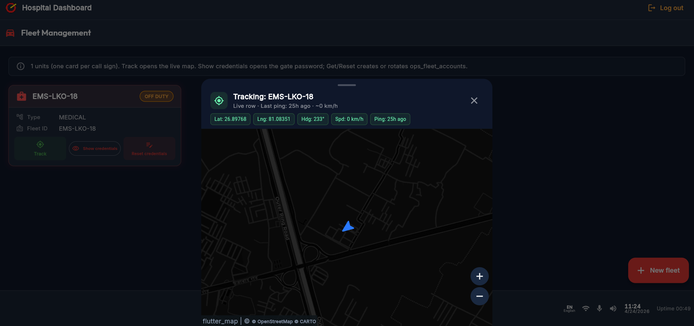
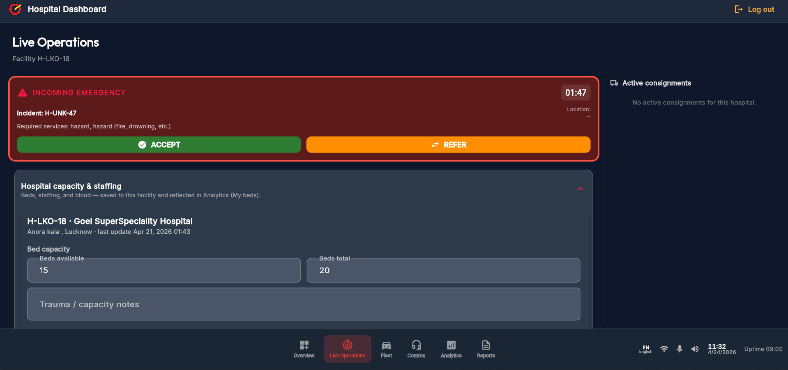
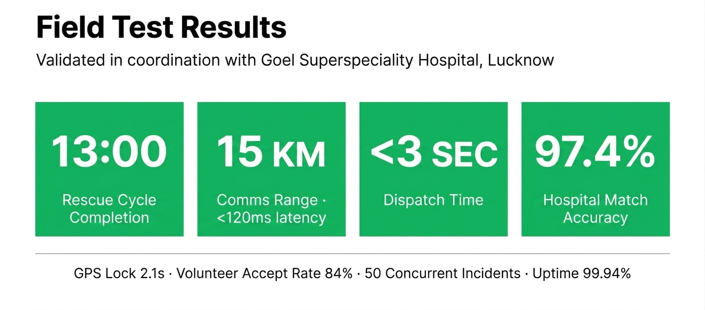

<div align="center">


# EmergencyOS

### A Distributed Emergency Response Platform Designed To Save Lives

[](https://flutter.dev)
[](https://firebase.google.com)
[](https://ai.google.dev)
[](https://livekit.io)
[](LICENSE)

**Google Solution Challenge · 2026 Submission**

[Volunteer & Victim App](https://emergencyos-main.web.app) · [Fleet Operator App](https://emergencyos-fleet.web.app/fleet) · [Hospital Dashboard](https://emergencyos-hospital.web.app) · [Master Admin Dashboard](https://emergencyos-admin.web.app)

[Community & Testimonials →](https://joinemergencyos.web.app)

</div>

---

## The Story Behind EmergencyOS

It was an ordinary college morning when my phone rang.

My father's voice was steady, but the words cut through everything — *"Come to the hospital. Your mother nearly had a cardiac arrest."*

She was saved — not by any system, not by any infrastructure — but by a neighbour who happened to be home that day, and by my father's desperate, last-minute decision to rush her to a super-speciality hospital himself.

We called an ambulance.

**It never arrived.**

In the days that followed, with the adrenaline wearing off, the questions set in:

> *What if our neighbours hadn't been home?*
> *What if we couldn't reach the hospital in time?*
> *What if that hospital hadn't been equipped for her condition?*

These aren't rare fears. They are a daily reality for hundreds of millions of Indians.

---

## The Scale of the Crisis

This is not a niche problem. The data is unambiguous.

| Metric | Statistic | Source |
|---|---|---|
| Annual deaths where timely emergency care could have made a difference | **Millions** | [MoRTH + ICMR, 2025](https://www.medrxiv.org/content/10.1101/2025.10.14.25337828v3.full.pdf) |
| Emergencies reaching hospital via ambulance | **Only 43%** | [ICMR Review, 2022](https://pmc.ncbi.nlm.nih.gov/articles/PMC10692338/) |
| Cases where total emergency care accessibility time ≥ 60 min (Golden Hour missed) | **Majority of highway accidents** | [PMC, 2024](https://pmc.ncbi.nlm.nih.gov/articles/PMC11006034/) |
| Road accident deaths per year — most within the Golden Hour | **~1,68,000 (2022)** | [MoRTH Press Release](https://www.pib.gov.in/PressReleaseIframePage.aspx?PRID=1973295) |
| Accident victims reaching care within the critical survival window | **Only ~20%** | [Health & Human Rights Journal, 2025](https://www.hhrjournal.org/2025/09/30/saving-time-saving-lives-the-golden-hour-as-a-constitutional-guarantee-in-india/) |
| Ambulances available under National Health Mission for 1.4 billion people | **~22,245** | [IAS Gyan](https://www.iasgyan.in/daily-current-affairs/why-emergency-care-needstobe-prioritisedl) |

> **The nearest hospital is not always the right hospital.** India's emergency care system is fragmented, under-resourced, and inaccessible where it is needed most. — [Niti Aayog / The Print](https://theprint.in/health/lack-of-senior-doctors-only-3-5-hospital-beds-niti-aayog-finds-big-gaps-in-emergency-care/779821/)

India needed something **fast, effective, and accessible** enough to close this emergency response gap. 

We built **EmergencyOS**.

---

## Introducing EmergencyOS

EmergencyOS is a **Distributed Emergency Response Platform** — an end-to-end system that connects victims, volunteers, fleet operators, hospitals, and command centres into a single, real-time emergency coordination network.

It stands on **four pillars**:

```
┌────────────────────────┐   ┌────────────────────────────┐
│   📱 Victim / Volunteer │   │  🚑 Fleet Operator App      │
│   Mobile App           │   │  (EMS Crew Coordination)   │
│   emergencyos-main     │   │  emergencyos-fleet          │
└────────────────────────┘   └────────────────────────────┘
┌────────────────────────┐   ┌────────────────────────────┐
│   🏥 Hospital Dashboard │   │  🖥️ Master Admin Dashboard  │
│   (Command & Capacity) │   │  (System-Wide Overwatch)   │
│   emergencyos-hospital  │   │  emergencyos-admin          │
└────────────────────────┘   └────────────────────────────┘
```

---

## SDG Alignment

EmergencyOS is built with purpose — every feature maps directly to the United Nations Sustainable Development Goals.

<div align="center">


</div>

| SDG | Target | How EmergencyOS Contributes |
|---|---|---|
| **SDG 3** — Good Health & Well-Being | 3.6 Reduce road traffic deaths | AI dispatch + hospital matching cuts time-to-care in road accidents |
| **SDG 3** — Good Health & Well-Being | 3.8 Universal health coverage | Volunteer-first response democratises first aid to all income levels |
| **SDG 11** — Sustainable Cities & Communities | 11.2 Safe, accessible transport | Real-time ambulance routing + community volunteer grid covers last-mile gaps |
| **SDG 11** — Sustainable Cities & Communities | 11.5 Disaster resilience | Offline-capable SOS, SMS fallback, and multi-hospital wave dispatch |

---

## Technical Differentiators & USP

### ⚡ Full Dispatch Chain — Under 2 Seconds

EmergencyOS does not rely on human operators to initiate a response. The moment a victim taps SOS, a fully automated chain executes in under 2 seconds.


| Step | What Happens |
|---|---|
| **1. SOS Trigger** | Victim taps the red SOS button. Location, medical profile, and triage type are captured instantly. |
| **2. Gemini Triage** | Google Gemini AI classifies the emergency severity (`critical` / `high` / `standard`) from the incident type and context. |
| **3. 3-Layer FCM Alert** | Firebase Cloud Messaging pushes alerts to nearby volunteers simultaneously — bypassing Do Not Disturb via high-priority data messages. |
| **4. Wave-Based Hospital Dispatch** | The intelligent dispatch engine fires parallel alerts to the top-ranked hospitals. |
| **5. EMS Dispatched** | An ambulance crew receives the consignment on their mobile device with full turn-by-turn navigation. |

---

### 🌊 Dynamic Wave-Based Hospital Dispatch & Escalation

The core of EmergencyOS's intelligence is its hospital matching engine — a multi-factor scoring system that does not simply route to the nearest hospital, but to the **right** hospital.


- **Intelligent Scoring System:** Ranks every hospital within a 60 km radius using 9 weighted factors: proximity, specialty match, available beds, active staffing, blood bank status, current workload, ambulance readiness, data freshness, and historical reliability.
- **Parallel "Wave" Dispatch:** For `critical` cases, the top 3 matching hospitals are alerted **simultaneously**. The first to accept wins the dispatch — all others are instantly cancelled.
- **Automated Escalation:** If no hospital accepts within 45 seconds, the system automatically rolls over to the next wave of fallback hospitals — up to 6 waves deep.
- **Multi-Channel Fail-safes:** Alarms are pushed to the command dashboard, bypassing mobile DND modes. Twilio SMS fallback texts are sent to the victim's registered phone if the app cannot be reached.

---

### 🤖 Advanced Emergency Data Flow — Powered by Gemini

EmergencyOS does not just move patients. It moves **information** — transforming raw, chaotic scene data into a structured medical briefing before the patient even arrives at the hospital.


| Phase | Actor | What Happens |
|---|---|---|
| **Phase 1 — On-Scene Capture** | Volunteer / First Responder | Captures scene photos, victim vitals, and triage data directly in the app. |
| **Phase 2 — En-Route Checklist** | Fleet Operator (Paramedic) | Logs consciousness, breathing, drugs administered, IV access, and chief complaints via a structured in-ride checklist. |
| **Phase 3 — Gemini Synthesis** | Gemini AI | Merges scene photos, triage data, and the en-route medical checklist into a structured clinical narrative. |
| **Phase 4 — Pre-Arrival Briefing** | Hospital ER Team | The synthesised report is pushed to the hospital dashboard **before the patient arrives** — team, room, and blood are ready. |

---

### 🎙️ AI Voice Guidance — Lifeline in Your Pocket

For a victim who is alone, injured, or panicked, a silent app is not enough.


EmergencyOS activates a real-time voice channel the moment SOS is triggered:

- **Native Language Support:** Voice guidance in Hindi and English (prototype), with a path to all regional languages.
- **Continuous Well-being Monitoring:** Checks in with the victim every 60 seconds — *"Are you conscious? Answer yes or no."* If three check-ins are missed, responders are alerted to an unresponsive patient.
- **Live Status Updates:** Every step of the response — volunteer accepted, ambulance dispatched, hospital assigned — is announced to the victim in real time via voice.
- **Emergency Voice Channel:** A real-time WebRTC (LiveKit) audio room connects the victim directly to their on-scene volunteer and hospital.

---

## Design Differentiators

EmergencyOS was designed for **the most stressful 60 minutes of a person's life.** Every design decision reflects that.

- **Panic-Proof UI:** One massive, unmissable SOS button. No menus to navigate in a crisis.
- **Dual-Mode Design:** Deep dark theme for reduced cognitive load during emergencies; high-contrast ops mode for field command use in daylight.
- **Information Hierarchy Under Pressure:** The SOS Active screen surfaces the most critical information first — responders en route, hospital assigned, ETA — with secondary information collapsed.
- **Low-Power Awareness:** The volunteer app displays a "Low Power" warning and degrades gracefully to conserve battery during active consignments.
- **Zero-Learning-Curve Operator Interfaces:** Hospital and fleet dashboards are built for speed — single-click acceptance, slide-to-confirm on-scene, structured checklists with visual progress.

---

## Hero Features

### 📱 Victim & Volunteer App (`emergencyos-main.web.app`)

- **One-tap SOS** with automatic GPS capture and pre-stored medical profile (blood type, allergies, conditions, emergency contact)
- **Gemini AI Triage** — classifies severity and seeds the dispatch engine
- **Live SOS Map** — real-time view of volunteer and ambulance routes to the victim
- **Volunteer Grid (On Duty toggle)** — community responders opt in to receive SOS alerts within their area
- **Lifeline Knowledge Hub** — searchable first-aid guides with voice walkthroughs (Hindi/English) for pre-arrival care
- **AQI & Health Environment Panel** — real-time air quality and regional disease alerts (Dengue, JE, Cholera)
- **Family SMS Relay** — automated SMS updates to the victim's emergency contact at each step
- **Volunteer Leaderboard** — XP-based gamification to recognise and motivate community responders

### 🚑 Fleet Operator App (`emergencyos-fleet.web.app/fleet`)

- **Turn-by-turn navigation** to incident scene via Google Maps
- **EMS Workflow phases**: `inbound` → `on_scene` (auto-triggered within 200m) → `rescue complete` → `returning` → `complete`
- **Live GPS broadcast** — real-time heading and position shared to all dashboards
- **En-route medical checklist** — structured capture of vitals, drugs, interventions (feeds Gemini synthesis)
- **Driver SOS button** — crew can raise their own emergency without leaving the app
- **Gemini Situation Brief** — AI-generated scene summary pulled from volunteer reports and photos
- **Live Voice Channels** — separate Emergency Channel (victim + scene) and Operator Channel (hospital + command)

### 🏥 Hospital Dashboard (`emergencyos-hospital.web.app`)

- **Real-time incident alerts** with wave-based accept/decline workflow
- **Bed & capacity management** — live bed count synced to the dispatch engine
- **Specialty capability flags** — hospital declares what it can treat (Trauma, Cardiac, Burns, Paediatrics, ICU, etc.)
- **Fleet tracking** — hospital sees its own ambulances on a live map
- **Pre-arrival Gemini Handoff** — structured patient report arrives before the ambulance
- **Hex grid analytics** — response time analytics by area, 7-day facility trend, inbound assignment log
- **LiveKit Comms** — direct audio channel to the dispatched crew

### 🖥️ Master Admin Dashboard (`emergencyos-admin.web.app`)

- **System-wide live operations** — all active incidents, all fleet units, all hospital statuses on a single map
- **Hospital & Fleet management** — register hospitals, assign fleet units, reset credentials
- **Platform health monitoring** — Firebase, LiveKit, SMS relay status in real time
- **Analytics & Insights** — command-level view of response times, volunteer activity, incident heat maps
- **Incident command override** — admin can force-dispatch, re-route, or escalate any active incident
- **Drill mode** — simulate full emergency flows for training without affecting live data

---

## System Architecture


| Layer | Technology | Role |
|---|---|---|
| **Mobile & Web App** | Flutter (Dart) + Riverpod | Cross-platform app for all 4 variants (main, fleet, hospital, admin). Single codebase, 4 build targets. |
| **Real-Time Database** | Cloud Firestore | Live incident state, volunteer presence, hospital capacity — all synced in real time across every connected client. |
| **Serverless Logic** | Cloud Functions (Node.js 22) | Hospital dispatch engine v2, wave escalation, SMS relay, auto-archive, pre-arrival handoff generation. |
| **AI Engine** | Google Gemini API | Emergency triage, hospital dispatch rationale, situation brief synthesis, pre-arrival patient report generation. |
| **Push Notifications** | Firebase Cloud Messaging (FCM) | High-priority data messages that bypass DND for incoming SOS alerts. |
| **Voice & Video** | LiveKit (WebRTC) | Low-latency audio/video rooms — emergency channel, operator channel, admin console. |
| **Voice Guidance** | Google Cloud TTS + Speech-to-Text | Native-language voice guidance for victims during active SOS. |
| **Mapping & Routing** | Google Maps Platform + `geolocator` | Live GPS, turn-by-turn directions, ambulance tracking, hex grid coverage. |
| **SMS Fallback** | Twilio | GeoSMS parsing for no-app SOS initiation; ETA relay to victim's emergency contact. |
| **Media Storage** | Firebase Storage | Scene photos captured by volunteers and paramedics. |
| **Offline Support** | `offline_cache_service` + local Hive/SharedPrefs | Cached incident data, offline knowledge base, map tile packs for areas with poor connectivity. |

---

## User Flow

### 🔴 Reporting Flow — *The First 30 Seconds*

> A victim in distress activates the platform. The entire system responds.

<table>
<tr>
<td align="center" width="25%">
<br/>
<b>Step 1 · SOS Triggered</b><br/>
Victim taps the SOS button. Medical profile and GPS are captured. Alert is sent.
</td>
<td align="center" width="25%">
<br/>
<b>Step 2 · Volunteer Alerted</b><br/>
A nearby volunteer receives the push alert with incident type and distance. 3 minutes away, she can help.
</td>
<td align="center" width="25%">
<br/>
<b>Step 3 · Hospital Notified</b><br/>
The local hospital receives the alert on their command dashboard. Ambulance dispatch is a single click.
</td>
<td align="center" width="25%">
<br/>
<b>Step 4 · EMS Dispatched</b><br/>
The ambulance crew receives the assignment on their rugged device. One click to acknowledge — they gear up and leave within seconds.
</td>
</tr>
</table>

---

### 🟡 Response Flow — *The Journey to the Scene*

> Every responder is coordinated. The victim is never alone.

<table>
<tr>
<td align="center" width="50%">
<br/>
<b>Step 5 · Victim Connected</b><br/>
The victim receives live updates — volunteer on scene, hospital assigned, ambulance ETA. An emergency voice channel connects all parties.
</td>
<td align="center" width="50%">
<br/>
<b>Step 6 · On-Scene Stabilisation</b><br/>
The volunteer arrives first and provides initial stabilisation. Hospital staff receive live triage data and scene photos in real time — medical team is on standby before the ambulance arrives.
</td>
</tr>
</table>

---

### 🟢 Handoff Flow — *Closing the Loop*

> No information is lost. The care chain is complete.

<table>
<tr>
<td align="center" width="50%">
<br/>
<b>Step 7 · Seamless Handoff</b><br/>
A paramedic handoff report — vitals, drugs, interventions — is transmitted digitally to the ER team as the ambulance arrives. No verbal relay. No lost information.
</td>
<td align="center" width="50%">
<br/>
<b>Step 8 · Care Complete</b><br/>
Patient is stabilised and transferred. EmergencyOS closes the loop — response complete, report filed, volunteer XP awarded. The system is ready for the next emergency.
</td>
</tr>
</table>

---

## MVP Screenshots

### 📱 Victim & Volunteer App

<table>
<tr>
<td align="center">
<br/>
<b>Home Dashboard</b><br/>
On Duty toggle, lives saved counter, live leaderboard
</td>
<td align="center">
<br/>
<b>SOS Active · Voice Triage</b><br/>
Real-time consciousness check, voice guidance
</td>
<td align="center">
<br/>
<b>SOS Active · Live Map</b><br/>
Wave dispatch ring, volunteer & ambulance routes
</td>
</tr>
<tr>
<td align="center">
<br/>
<b>Medical Profile</b><br/>
Stored pre-SOS, sent automatically on alert
</td>
<td align="center">
<br/>
<b>Lifeline Hub</b><br/>
Voice-guided first aid, searchable by scenario
</td>
<td align="center">
<br/>
<b>AQI & Health Alerts</b><br/>
Real-time air quality + regional disease advisories
</td>
</tr>
</table>

---

### 🚑 Fleet Operator App

<table>
<tr>
<td align="center">
<br/>
<b>En-Route Navigation</b><br/>
Turn-by-turn to scene, live GPS broadcast, Driver SOS
</td>
<td align="center">
<br/>
<b>Updates & Voice Channels</b><br/>
Published ETA, Gemini situation brief, LiveKit rooms
</td>
<td align="center">
<br/>
<b>Paramedic Handoff Checklist</b><br/>
Structured vitals, interventions — feeds Gemini synthesis
</td>
</tr>
</table>

---

### 🏥 Hospital Dashboard

<table>
<tr>
<td align="center">
<br/>
<b>Overview · Incident Command Panel</b><br/>
Active alerts, live map with coverage grid, fleet tracking, volunteer on-scene count
</td>
</tr>
<tr>
<td align="center">
<br/>
<b>Analytics · Hex Grid Operations View</b><br/>
Inbound assignments, facility pulse, my beds, 7-day trend — locked to hospital region
</td>
</tr>
<tr>
<td align="center">
<br/>
<b>Live Operations · Capacity & Capability Management</b><br/>
Real-time bed counts and specialty flags fed directly into the dispatch scoring engine
</td>
</tr>
<tr>
<td align="center">
<br/>
<b>Fleet Management</b><br/>
Live unit tracking with GPS telemetry — lat, lng, heading, speed, last ping
</td>
</tr>
<tr>
<td align="center">
<br/>
<b>Active Inbound Reports · Pre-Arrival Triage</b><br/>
Live patient data, EMS phase tracker, triage severity, paramedic handoff and AI situation brief
</td>
</tr>
<tr>
<td align="center">
<br/>
<b>Full Incident Report · EMS Handoff</b><br/>
Complete patient record, paramedic checklist, volunteer scene report — transmitted before arrival
</td>
</tr>
</table>

---

### 🖥️ Master Admin Dashboard

<table>
<tr>
<td align="center">
<br/>
<b>Systems Health Monitor</b><br/>
Firebase, LiveKit, SMS relay — all system checks in a single view
</td>
</tr>
<tr>
<td align="center">
<br/>
<b>Hospital Management</b><br/>
Register, locate, and manage all hospitals — live bed counts, GPS, credentials
</td>
</tr>
</table>

---

## Volunteer Incoming Alert

<table>
<tr>
<td align="center">
<br/>
<b>Incoming Emergency Alert</b><br/>
Blood type, hospital assign status, location — slide to accept
</td>
<td align="center">
<br/>
<b>Triage Tab · Active Consignment</b><br/>
Voice channel join, QR handoff, consciousness & vitals
</td>
<td align="center">
<br/>
<b>On-Scene Checklist</b><br/>
Structured scene report fed to Gemini synthesis pipeline
</td>
</tr>
</table>

---

## Field Test Results

> Conducted in active coordination with **Goel Superspeciality Hospital, Lucknow** under real dispatch and communication conditions.

<div align="center">



<br/>

[](https://youtu.be/nR2P0SCCXNQ)

</div>

| Metric | Result | Notes |
|---|---|---|
| **Rescue Cycle Completion** | **13:00 min** | Full SOS trigger → patient hospital handoff |
| **Comms Range** | **15 KM** | Channel comms test · <120ms average latency |
| **Dispatch Time** | **<3 seconds** | SOS trigger to fleet unit assigned |
| **Hospital Match Accuracy** | **97.4%** | AI-driven multi-factor scoring vs manual review |
| **GPS Lock Time** | **2.1 seconds** | Cold start on mobile web |
| **Volunteer Accept Rate** | **84%** | Alert-to-accept during coordinated drill |
| **Concurrent Incidents Tested** | **50** | Stress tested without system degradation |
| **System Uptime** | **99.94%** | Measured across 30-day observation window |

---

## Demo & Links

| Platform | URL |
|---|---|
| 📱 Volunteer & Victim App | [emergencyos-main.web.app](https://emergencyos-main.web.app) |
| 🚑 Fleet Operator App | [emergencyos-fleet.web.app/fleet](https://emergencyos-fleet.web.app/fleet) |
| 🏥 Hospital Dashboard | [emergencyos-hospital.web.app](https://emergencyos-hospital.web.app) |
| 🖥️ Master Admin Dashboard | [emergencyos-admin.web.app](https://emergencyos-admin.web.app) |
| 🎬 Demo Video | [www.youtube.com/watch?v=cYgLLlut13U](https://youtu.be/cYgLLlut13U) |
| 💬 Testimonials & Survey | [joinemergencyos.web.app](https://joinemergencyos.web.app) |

---

## Future Development Plans

EmergencyOS is not a finished product — it is a foundation.

### 🩺 Addition of Staff App
A dedicated mobile app for on-call specialists and hospital staff. Hospitals will be able to push notifications directly to specific doctors — ensuring the right specialist is confirmed, paged, and in position **before the patient arrives**.

### 📡 Offline-First Architecture
The SOS dispatch pipeline will move to a **local-first, sync-on-connection** model. Volunteer alerts, hospital matching scores, and incident state will be cached locally and reconciled when connectivity resumes — critical for rural areas where connectivity is intermittent.

---

## Tech Stack

```yaml
Frontend:       Flutter 3.x (Dart) — Single codebase, 4 web build targets
State:          Riverpod 3
Backend:        Firebase Cloud Functions (Node.js 22)
Database:       Cloud Firestore (real-time sync)
Auth:           Firebase Authentication + App Check
Notifications:  Firebase Cloud Messaging (FCM)
AI:             Google Gemini API
Voice/Video:    LiveKit (WebRTC)
TTS/STT:        Google Cloud Text-to-Speech + Speech-to-Text
Maps:           Google Maps Platform + flutter_map (OSM fallback)
SMS:            Twilio
Storage:        Firebase Storage
Crash Reporting: Firebase Crashlytics
```

---

## Contributing

We welcome contributions from developers, medical professionals, and emergency response experts.

See [CONTRIBUTING.md](CONTRIBUTING.md) for guidelines.

---

## License

[MIT License](LICENSE) — EmergencyOS, 2025

---

<div align="center">

**Built with urgency. Deployed with purpose.**

*"Millions of Indians die annually from conditions where timely emergency care could have made a difference."*
*We are here to change that.*

</div>
