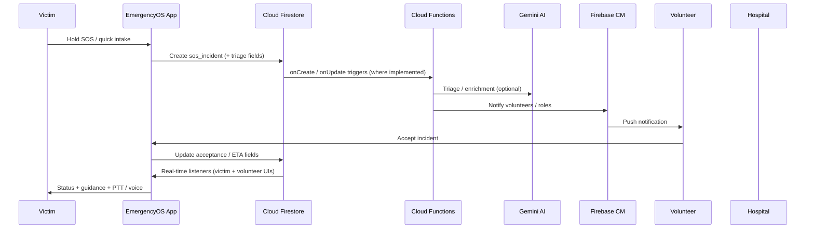

# EmergencyOS — Architecture

## Overview

EmergencyOS is a **Flutter** client (mobile + web) backed by **Firebase** (Auth, Firestore, Functions, FCM, Hosting). Optional **Gemini** calls run from **Cloud Functions** to keep API keys off devices. **Google Maps** powers routing and visualization; **LiveKit** supports Lifeline / dispatch voice where configured.

## High-level sequence (SOS → dispatch)

## Key collections (conceptual)

- `sos_incidents` — live and historical incidents, triage, acceptance lists, ETAs  
- `users` — profile, medical hints, PIN hashes (see security rules)  
- `volunteer_presence`, `ops_fleet_units` — operational layers  
- `analytics_events` — optional impact telemetry from `UsageAnalyticsService`  

## Client modules

- `lib/features/sos/` — SOS UI, intake, active lock, dispatch overlay  
- `lib/features/map/` — map, zones, offline directory  
- `lib/features/ai_assist/` — Lifeline training / guidance shell  
- `lib/features/staff/` — admin / command / ops / impact dashboard  
- `lib/services/` — Firestore gateways, connectivity, escalation, SMS geo, etc.  

See also [SECURITY.md](SECURITY.md) and [API.md](API.md).
